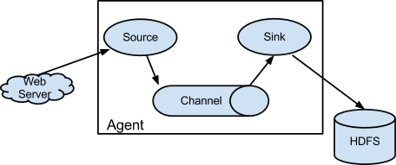
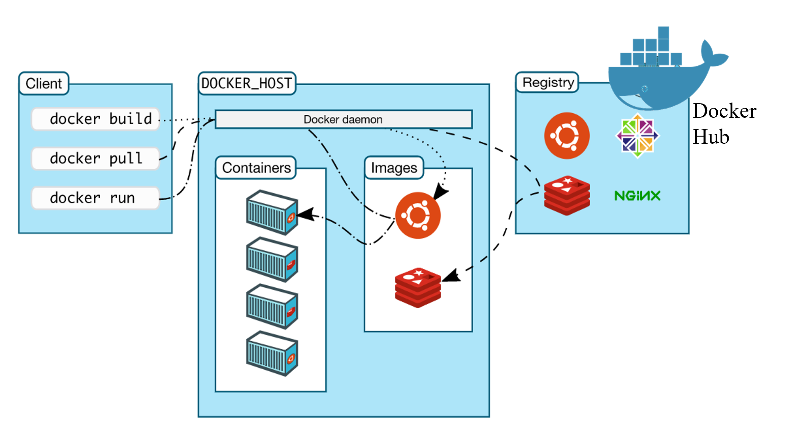
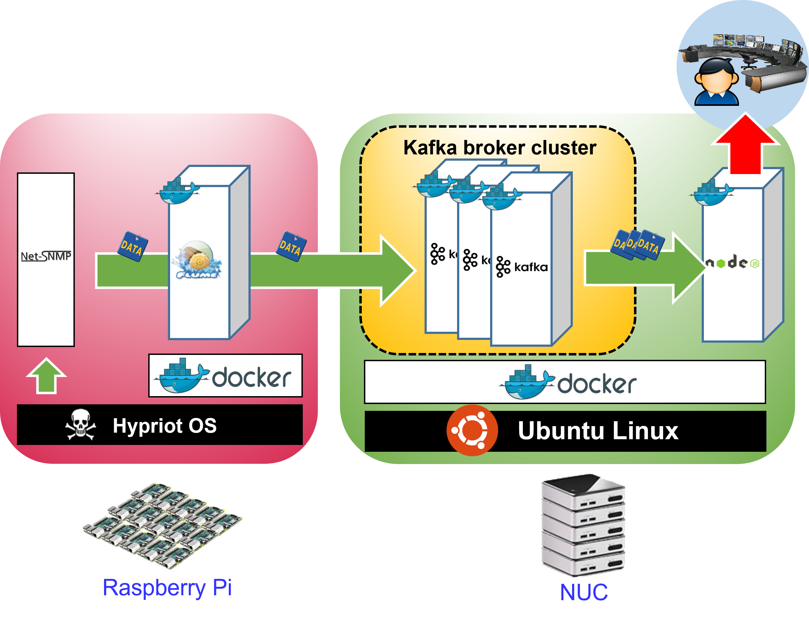
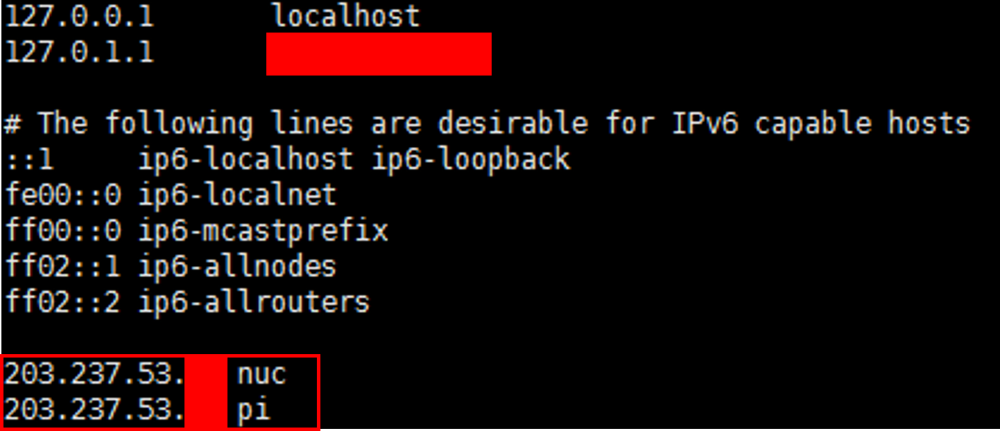

# 2. InterConnect Lab

## Objective

The main part of interConnect Lab is to connect one box with another box which connects computer systems in 2 ways. (Physical interconnect, Data interconnect)

- Physical Interconnect: Connection between boxes via the network.
- Data Interconnect: By using physical Interconnect, connect data between various functions.

## Concept

### Raspberry PI

Raspberry PI is a small, embedded computer designed by Raspberry Pi Foundation. It has different HW and properties. For example, It doesn't have HW real-time clock. So, after booting, the time of PI is initialized. In this lecture, we will use Pi2.

### Apache Kafka


Apache Kafka is a messaging system with a unique design and functionality.

- Topics: maintains feeds of messages in categories
- Producer: processes that publish messages to a Kafka topic
- Consumer: processes that subscribe to topics and process the feed of published messages
- Broker: run as a cluster comprised of one or more servers

### Net-SNMP

A suite of software for using and deploying the SNMP Protocol.

- Manager: polls agents on the network, correlates, and displays information
- Agent: collects and stores information, responds to manager requests for information, generates traps


The SNMP(Simple Network Management Protocol) is used in network management systems to monitor network-attached devices, which include routers, switches, servers, workstations, printers, modem racks, and more.


### Apache-Flume



A distributed, reliable, and available service for efficiently collecting, aggregating, and moving large amounts of log data with many customizable sources, which runs asynchronously. Flume Agents consists of three concepts.

- Source: Consumes events having a specific format
- Channel: Holds the event until consumed
- Sink: Removes an event from the channel and puts it into an external repository or another source

### Docker

"Docker” is a containerization technology that enables the creation and use of Linux® containers. Based on containerization, you can use it for Application deployment.



## Practice



### Check `rc-local.service` Setting (In NUC)

```bash
sudo touch /etc/rc.local
sudo chmod +x /etc/rc.local
sudo vi /lib/systemd/system/rc-local.service
```

Add below lines in `rc-local.service`

```text
...
[Install]
WantedBy=multi-user.target
...
```

Apply the setting and check the `rc-local.service` status

```bash
sudo systemctl enable rc-local.service
sudo systemctl start rc-local.service
sudo systemctl status rc-local.service
```


<!-- http://realtechtalk.com/Debian_Ubuntu_Mint_rclocal_service_startup_error_solution_rclocalservice_Failed_at_step_EXEC_spawning_etcrclocal_Exec_format_error-2242-articles -->
If you get Exec format error, Open `/etc/rc.local` and check the first line is `#!/bin/sh -e` and the last line is `exit 0`.

```bash
sudo vim /etc/rc.local
```

```bash
#!/bin/sh -e
...
exit 0
```

Reboot your NUC

```bash
sudo reboot
```

### Raspberry PI OS Installation

Before we start, your Raspberry Pi must be ready with the proper OS. In this lab, we will use “HypriotOS” Linux for it. Insert a Micro SD into your SD card reader and attach the reader to your NUC.

> When you deal with the SD card, be sure that PI is shut down. Ejecting an SD card when PI is booted on is one of the main causes of SD card corruption which results in a fatal error.
> If you want to unmount your SD card safely, turn off PI with the `poweroff` command.
>
> ```bash
> sudo poweroff # It requires superuser permission.
> ```

#### Download Required Package and File(In NUC)

Type the commands below to get the “flash” script for the OS setup. Then, type the `flash` command to see if it’s installed correctly.

```bash
sudo apt update && sudo apt install -y pv curl python3-pip unzip hdparm
sudo pip3 install awscli
curl -O https://raw.githubusercontent.com/hypriot/flash/master/flash
chmod +x flash
sudo mv flash /usr/local/bin/flash
```

After installing `flash`, clone the repository from Github. You need to install `git-lfs` first because this repository contains large files.

```bash
cd ~
sudo apt install -y git
curl -s https://packagecloud.io/install/repositories/github/git-lfs/script.deb.sh | sudo bash
sudo apt install -y git-lfs
git lfs install
git clone https://github.com/SmartX-Labs/SmartX-Mini.git
cd ~/SmartX-Mini/SmartX-Mini-MOOC\ Collection/Experiment/Lab-2.\ Inter-Connect/
```

Next, you need to download HypriotOS from GitHub

```bash
wget https://github.com/hypriot/image-builder-rpi/releases/download/v1.9.0/hypriotos-rpi-v1.9.0.img.zip
ls -alh # Check all files
```

#### Edit HypriotOS setting and flash SD card.(In NUC)

To modify the HypriotOS configuration file for your Raspberry Pi, open the `hypriotos-init.yaml` file and edit its network section.

```bash
sudo vim hypriotos-init.yaml
```

```yaml
…
 # static IP configuration:
      interface eth0
      static ip_address=172.29.0.250/24 # Write your Raspberry Pi address
      static routers=172.29.0.254 # Write your Gateway address
      static domain_name_servers=8.8.8.8 8.8.4.4 # Write your given DNS server
…
```

The assigned IP address will be automatically applied when you’re initially booting your Raspberry Pi.

To flash your OS to an SD card, you need to know where your card is mounted.

```bash
sudo fdisk -l
```


Then flash HypriotOS to your MicroSD Card. This takes a while, wait for a moment.

```bash
flash –u hypriotos-init.yaml -d /dev/sdc –f hypriotos-rpi-v1.9.0.img.zip
```

Insert the SD card back into your Raspberry PI and boot it up.

### Raspberry PI network Configuration

#### Check network setting(In PI)

In PI, type `ifconfing` to check your network interface setting

```bash
ifconfig
```

Then check the routing table

```bash
netstat -rn
```

#### Install required packages(In PI)

You need to install several packages in PI.

```bash
sudo apt update
sudo apt install -y openssh-server git vim rdate
```

`rdate` sync your PI's time to network. If PI's time(using the `date` command) is incorrect, type the command below.

```bash
rdate -s time.bora.net
```

`openssh-server` enables ssh connections to your PI.
After installing the SSH server, you can access your PI from another computer with SSH.

```bash
ssh pirate@[PI_IP] #ID: pirate PW: hypriot
```

### Hostname Preparation

Every machine in a network that communicates with itself must know its address. This information is stored in `/etc/hosts`.

#### Hostname preparation for Kafka(In NUC)

Open `/etc/hosts` in NUC.

```bash
sudo vim /etc/hosts
```

Add 2 lines below the file.

```text
[NUC_IP] [NUC_HOSTNAME]
[PI_IP] [PI_HOSTNAME]
```



To check your hostname, you can use  the `hostname` command.

```bash
hostname
```

#### Hostname preparation for Kafka(In PI)

Repeat the same job in Raspberry PI.

```bash
sudo vim /etc/hosts
```

Add 2 lines below the file.

```text
[NUC_IP] [NUC_HOSTNAME]
[PI_IP] [PI_HOSTNAME]
```

When pi is rebooted, the information in `/etc/hosts` disappears.

#### Verification for hostname preparation(In PI, NUC)

For NUC,

```bash
sudo ping [Your NUC hostname]
sudo ping [Your Raspberry PI hostname]
```

For Raspberry PI,

```bash
sudo ping [Your NUC hostname]
sudo ping [Your Raspberry PI hostname]
```

If it was successful, We can be sure that NUC knows its hostname and Pi’s hostname and Pi also know its hostname and NUC’s hostname.

### Kafka Deployment(IN NUC)

We’ll use one zookeeper, 3 brokers, and one consumer containers that share the host’s public IP address. The zookeeper container doesn’t have a broker id. Each Broker has a unique id and port to interact with each other. The consumer container is just used to manage topics and check the data from brokers.

| Function(container) Name | IP Address | Broker ID | Listening Port |
|:------------------------:|:----------:|:---------:|:--------------:|
|         zookeeper        |  Host's IP |     -     |      2181      |
|          broker0         |  Host's IP |     0     |      9090      |
|          broker1         |  Host's IP |     1     |      9091      |
|          broker2         |  Host's IP |     2     |      9092      |
|         consumer         |  Host's IP |     -     |        -       |

#### Clone repository from GitHub

```bash
cd ~
git clone https://github.com/SmartXBox/SmartX-mini.git
```

In this section, we use `ubuntu-kafka`.

```bash
cd ~/Smartx-mini/ubuntu-kafka
```

#### Check Dockerfile

Open `Dockerfile` and check it is correct.

```dockerfile
FROM ubuntu:14.04
LABEL "maintainer"="Seungryong Kim <srkim@nm.gist.ac.kr>"

#Update & Install wget
RUN sudo apt-get update
RUN sudo apt-get install -y wget vim iputils-ping net-tools iproute2 dnsutils openjdk-7-jdk

#Install Kafka
RUN sudo wget --no-check-certificate https://archive.apache.org/dist/kafka/0.8.2.0/kafka_2.10-0.8.2.0.tgz -O - | tar -zxv
RUN sudo mv kafka_2.10-0.8.2.0 /kafka
WORKDIR /kafka
```

#### Build docker image

Then build docker image with `docker build`. It takes a long time.

```bash
sudo docker build --tag ubuntu-kafka . #You should type '.'
```

It's good to know basic docker commands. For more detail, visit [docker official document](https://docs.docker.com/engine/reference/commandline/cli/).

```bash
docker --help #show docker instruction 
docker ps # show list of container
docker rm # remove docker container
docker start [container_name] # start docker container
docker stop [container_name] # stop docker container
docker attach [container_name] # connect docker container
```

#### Place docker containers

After building the `ubuntu-kafka` image, make, run and attach the docker container

```bash
docker run -it --net=host --name [container name] ubuntu-kafka
```

We need to run total 5 containers (`zookeeper`, `broker0`, `broker1`, `broker2`, `consumer`)

#### Zookeeper configuration(IN NUC, `zookeeper` container)

In the `zookeeper` container, Open the zookeeper properties file.

```bash
vi config/zookeeper.properties
```

Check the client port is `2181`

Execute the zookeeper first, leave the zookeeper running and open a new terminal for the next tasks.

```bash
bin/zookeeper-server-start.sh config/zookeeper.properties 
```

#### Broker configuration(IN NUC, `broker0`, `broker1`, `broker2` containers)

Open server properties file and change proper broker id and port (they must be unique to each other) 

```bash
vi config/server.properties
```

| Function(container) Name | IP Address | Broker ID | Listening Port |
|:------------------------:|:----------:|:---------:|:--------------:|
|          broker0         |  Host's IP |     0     |      9090      |
|          broker1         |  Host's IP |     1     |      9091      |
|          broker2         |  Host's IP |     2     |      9092      |


Execute Kafka brokers.

```bash
bin/kafka-server-start.sh config/server.properties 
```

Repeat this in 3 broker containers. (`broker0`, `broker1`, `broker2`)

#### Consumer topic configuration(IN NUC, `consumer` container)

Create a topic named `resource` in consumer.

```bash
bin/kafka-topics.sh --create --zookeeper localhost:2181 --replication-factor 1 --partitions 3 --topic resource
```

We can check topics.

```bash
bin/kafka-topics.sh --list --zookeeper localhost:2181 # list all topic of zookeeper in localhost:2181
bin/kafka-topics.sh --describe --zookeeper localhost:2181 --topic resource # Check existence of topic `resource` of zookeeper in localhost:2181
```

### Flume on Raspberry PI(IN PI)

#### Install Net-SNMP installation

```bash
sudo apt update
```

Download Net-SNMP

```bash
sudo apt install -y snmp snmpd snmp-mibs-downloader openjdk-8-jdk
```

Modify the configuration file. There is a line `#rocommunity public localhost`. Delete `#`.

```bash
sudo vi /etc/snmp/snmpd.conf
```

Restart `snmpd.service`.

```bash
sudo systemctl restart snmpd.service
```

#### Clone repository from GitHub

```bash
cd ~
git clone https://github.com/SmartXBox/SmartX-mini.git
```

In this section, we use `raspbian-flume`.

```bash
cd ~/Smartx-mini/raspbian-flume
```

#### Check Dockerfile

Open `Dockerfile` and check it is correct.

```dockerfile
FROM balenalib/rpi-raspbian:stretch
LABEL "maintainer"="Seungryong Kim <srkim@nm.gist.ac.kr>"

#Update & Install wget, vim
RUN sudo apt update
RUN sudo apt install -y wget vim iputils-ping net-tools iproute2 dnsutils openjdk-8-jdk

#Timezone
RUN sudo cp /usr/share/zoneinfo/Asia/Seoul /etc/localtime

#Install Flume
RUN sudo wget --no-check-certificate http://www.apache.org/dist/flume/1.6.0/apache-flume-1.6.0-bin.tar.gz -O - | tar -zxv
RUN mv apache-flume-1.6.0-bin /flume
ADD plugins.d /flume/plugins.d
ADD flume-conf.properties /flume/conf/

#Working directory
WORKDIR /flume
```

#### Build docker image

Then build docker image with `docker build`. It takes a longer time than NUC.

```bash
sudo docker build --tag raspbian-flume .
```

#### Run flume on container

After building the image, run the `flume`  container.

```bash
sudo docker run -it --net=host --name flume raspbian-flume
```

In, the `flume` container, check the configuration file, Modifying the broker list. (Change default  value `nuc` to your own NUC's hostname in `/etc/hosts)

```bash
vi conf/flume-conf.properties
```

Then run flume on `flume` container.

```bash
bin/flume-ng agent --conf conf --conf-file conf/flume-conf.properties --name agent -Dflume.root.logger=INFO,console
```

If an error occurs, check the host of pi again.

### Consume message from brokers(IN NUC, IN `consumer` container)

Launch consumer script on the `consumer` container.

```bash
bin/kafka-console-consumer.sh --zookeeper localhost:2181 --topic resource --from-beginning
```


## Review

### Lab Summary

1. How to physically inter-connect two kinds of Boxes? (NUC and Raspberry PI)
2. How to inter-connect data transfer (via Kafka messaging) between functions located in different boxes?

You need to distinguish physical Inter-connect from data Inter-connect!

> Thank You for Your Attention Any Questions? -> khs0404@smartx.kr
